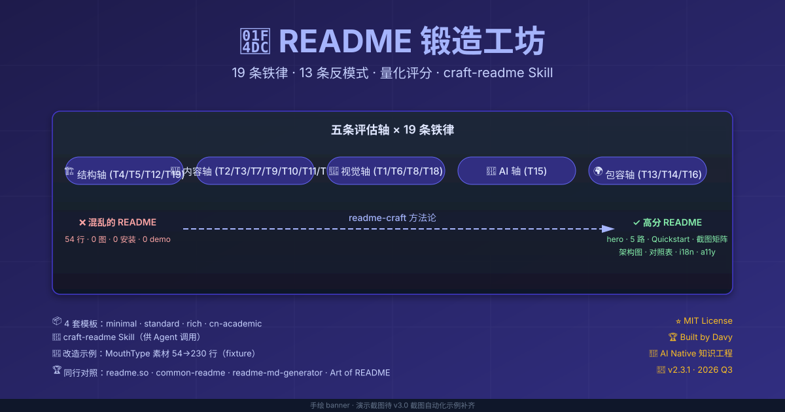
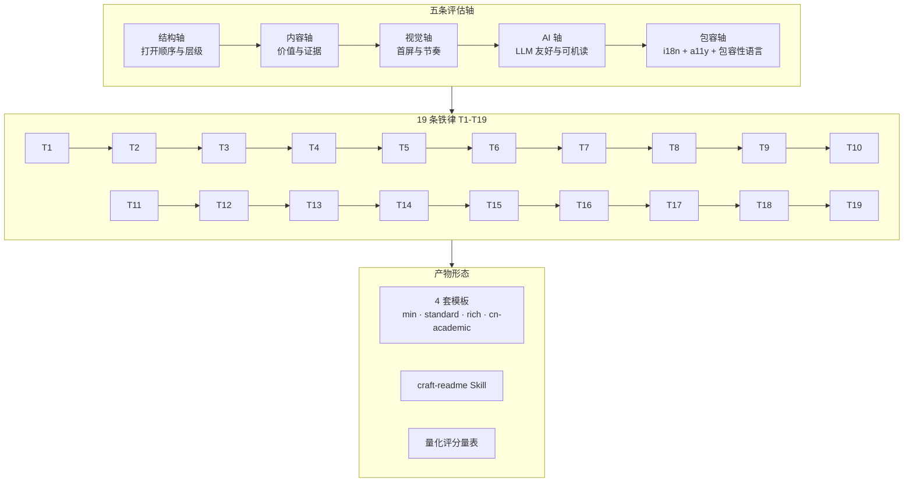

<div align="center">

# 📜 README 锻造工坊

**19 条铁律 + 13 条反模式 + 量化评分量表 + craft-readme Skill — AI Agent 时代的 README 写作方法论。**

让任何项目的 README 都能按同一套量化量表逐项自检、定位缺口，而不是靠模板拼凑碰运气。

[](./METHODOLOGY.md)
[](./METHODOLOGY.md#3-13-条反模式必须避免--v23)
[](./checklist.md)
[](./templates/)
[](./skill/SKILL.md)
[](./examples/)
[](./LICENSE)

</div>

<!-- BEGIN GENERATED:version-summary -->
> 规范版本 **3.0.0-alpha.0** · **19** 条铁律 · **13** 条反模式 · 评分对外展示：归一化百分制 + 适用项数 + 未核验项数（原始得分 / 适用满分见检查报告）
<!-- END GENERATED:version-summary -->

---

## 🎬 一图看明白



> **左上：差的 README** — 54 行 0 图 0 安装 0 demo，堆文字、零视觉、零节奏。
> **右上：readme-craft 输出** — hero + 铁律触发 + Quickstart + 截图矩阵 + 架构图 + 对照表 + i18n + a11y。
> **下方：方法论的 19 条铁律 + 13 条反模式 + 量化评分**，贯穿"结构 × 内容 × 视觉 × AI × 无障碍"五轴。

> 📌 **资产说明**：当前视觉入口是手绘 `banner.svg`。演示截图由 Playwright / VHS 截图自动化示例补齐（见 [Roadmap](#-roadmap)）。

---

## ✨ 6 条核心亮点

1. **19 条铁律 + 13 条反模式** — 不是 checklist，是**互相约束的判断框架**；任意一条违反会拖累其他 18 条。
2. **方法论先于模板** — 基于 fastapi / deno / supabase / huggingface / ollama / tailwind / lobe-chat / fiber 等 8 个 GitHub Trending 范本逐字逐行提炼。
3. **4 套场景化模板** — minimal · standard · rich · cn-academic，按项目类型挑，不混搭。
4. **Agent Skill 直接调用** — 一句话让 Claude Code / Codex / Qwen 按方法论产出高分 README。
5. **六类项目 fixture** — CLI、库、桌面、Web、服务、知识库均有正向/负向样例，可复验规则行为。
6. **量化评分 + AI 时代适配** — 覆盖 i18n / LLM 友好 / 无障碍 / 包容性语言 / 默认语言 / 截图自动化 / CI 可复现的 README 方法论。

---

## 🚀 快速使用（4 步）

### 第 0 步 · 拉下来

```bash
git clone git@github.com:davyzhong/readme-craft.git
cd readme-craft
ls -F    # 看到 METHODOLOGY.md / templates/ / skill/ / examples/ / checklist.md
```

### 第 1 步 · 接入你的 Agent

任选其一：

```bash
# 方式 A · Skill 软链（Claude Code / Codex / Qwen）
ln -s /path/to/readme-craft/skill <skills-dir>/craft-readme
# 或 <skills-dir>/craft-readme，取决于你的 Agent 技能目录
```

```text
# 方式 B · 提示词引用（不改文件系统）
在 Agent 提示词里加：@/path/to/readme-craft/skill/SKILL.md
```

然后在 Agent 里说：**"帮我给 ~/workspace/my-project 写一个 README，按 rich 模板风格"**。

### 第 2 步 · 回答 5 个关键问题

Skill 会自动问你 5-7 个问题（[见 SKILL.md Step 4](./skill/SKILL.md)）：一句话讲清项目做什么给谁用 / 版本与许可证 / 推荐安装方式 / 可用截图 / 谁在用。

### 第 3 步 · 自检 + 拷回

```bash
# 按 checklist.md 19 条自检（3-5 分钟），然后把产物拷回目标项目
cp <生成的 README> YOUR_PROJECT/README.md
cd YOUR_PROJECT
git add README.md && git commit -m "docs: README 按 readme-craft 方法论重写" && git push
```

---

## 📦 3 种集成方式

| 方式 | 命令 / 做法 | 适用场景 |
|---|---|---|
| **1 · 直接 clone** | `git clone git@github.com:davyzhong/readme-craft.git` | 想读方法论全文 |
| **2 · Skill 软链** | `ln -s /path/to/readme-craft/skill <skills-dir>/craft-readme` | Claude Code / Codex / Qwen 用户 |
| **3 · `@/path` 引用** | 在 Agent 提示词里加 `@/path/to/readme-craft/skill/SKILL.md` | 不想改文件系统 |

> **Web 评分页**已上线：<https://davyzhong.github.io/readme-craft/>（粘贴 README + 显式选类型即可评分，内容不离开浏览器）；本地运行 `pnpm web:preview`。
> **GitHub Action** 已发布：`davyzhong/readme-craft@v1`（只读封装 `check`，输出已核验得分/适用满分/未核验项数/JSON 报告路径；无 PR 回写、无 token 需求）。Marketplace 收录需仓库页面手动一次操作（可选）。

---

## 🔧 工具链（v3.0-alpha，本仓自带）

仓库内置确定性工具链（Node 24 + pnpm，`rules.yaml` 为规则单一事实源），以下命令均已实测可用：

```bash
pnpm install --frozen-lockfile
pnpm readme-craft validate          # 校验本仓：版本一致、口径、链接锚点、占位符、生成区块新鲜度
pnpm readme-craft generate --check  # 校验生成区块无漂移（不带 --check 则重新生成）
pnpm readme-craft check <项目路径> [--type cli|library|desktop|web-app|service|knowledge-base] [--format json]
pnpm readme-craft pack-skill        # 构建确定性 Skill 平铺包（dist/craft-readme/，同版本重建零 diff）
pnpm readme-craft install-skill --target <路径>   # 安装到显式目标；内容不同默认拒绝，--replace 才覆盖
```

**Web 评分页**：<https://davyzhong.github.io/readme-craft/>（在线版，内容不离开浏览器）；本地构建与测试：

```bash
pnpm web:preview   # 构建并在 http://localhost:4173/ 预览本地评分页（Ctrl+C 停止）
pnpm web:test      # Web/CLI 一致性测试（同 fixture 的 browser-safe 规则结果逐项相等）
pnpm web:build     # 仅构建 web/dist/app.js（esbuild，重建零 diff）
pnpm run build     # 构建独立 CLI bundle dist/readme-craft.mjs（内嵌规则，无源码可运行）
```

`check` 的对外报告只展示归一化百分制 + 适用项数 + 未核验项数；agent-reviewed 规则默认 `unverified`，可用 `--review <yaml>` 合并 Agent 评分后再输出总分。退出码：`0` 成功、`1` 规则/一致性失败、`2` 参数/环境错误。

**批量审计一批项目**（v3.0-alpha 实战沉淀）：

```bash
node scripts/batch-audit.mjs ~/workspace --exclude readme-craft --out /tmp/audit.md [--strict]
```

对目录下所有含 README.md 的子项目逐个体检并汇总缺口表；T19 链接检查 job 可复制模板见 [examples/ci-recipes/](./examples/ci-recipes/)。审计输出可能包含仓库名与评分，应保存在私有位置，公开分享前先脱敏并核实授权。

---

## 🏆 同类工具与方法对照

下表按各项目公开说明归纳，反映 **2026-09-25** 可查到的定位；市场变化快，此表是代表性样本，不声称穷尽所有工具。不同工具的评分口径不可直接横比。

| 工具 | 主要用途 | 与 readme-craft 的关系 |
|---|---|---|
| [readme.so](https://github.com/octokatherine/readme.so) | 在线选择、编辑、拖动 README 章节并下载 | 适合快速搭结构；本项目提供规则、审查与持续核验 |
| [readme-md-generator](https://github.com/kefranabg/readme-md-generator) | 从 `package.json` 和 Git 配置读取默认值的 CLI 生成器 | 适合初始化 Node 项目文档；本项目覆盖跨类型规则与检查 |
| [readme-ai](https://github.com/eli64s/readme-ai) | 通过 LLM 分析仓库并生成 README | 侧重生成；本项目强调证据约束、显式未核验状态和确定性评分 |
| [README Health Checker](https://github.com/tahaefekusoglu/Readme-Health-Checker) | CLI + GitHub Action 评分、链接检查、可配置权重、模板与可选 AI 建议 | 是最接近的检查类替代；其可配置评分与 PR 评论能力值得持续对照 |
| [README Forge](https://github.com/Atypical-Consulting/readme-forge) | 跨组织批量打分、自动补齐和进度面板 | 适合多仓治理；本项目聚焦单仓写作方法、Skill 与离线检查 |
| [readme-doctor](https://classic.yarnpkg.com/en/package/readme-doctor) | 小型 CLI + Action，提供章节补齐和评分门槛 | 有功能重叠；公开维护信号较弱，需在采用前复核当前源仓库与活跃度 |
| [standard-readme](https://github.com/RichardLitt/standard-readme) | 面向开源库的规范、示例，并链接 lint 与 generator | 提供成熟结构约定；本项目采用按类型分支、19 条规则和 N/A/未核验模型 |
| [github-readme-generator](https://github.com/pekral/github-readme-generator) / [readme-crafter-skill](https://github.com/linhai0872/readme-crafter-skill) | Agent Skill 根据仓库证据撰写 README | 与本项目 Skill 直接相邻；本项目另外提供显式规则源、CLI、Action 和 Web 评分页 |

另有 [LintMe 研究原型](https://doi.org/10.1145/3772318.3791597)探索可配置的内容与风格规则；[ReadMe AI Linter](https://docs.readme.com/main/docs/linter)面向 ReadMe 托管文档产品，并非 GitHub 仓库 README 的直接替代。

---

## 📐 19 条铁律速览

<!-- BEGIN GENERATED:rule-summary -->
| # | 铁律 | 轴 | 核心动作 | 评估方式 |
|---|---|---|---|---|
| **T1** | 视觉锤 | 视觉 | 首屏用中央 logo + tagline + hero 视觉建立辨识度 | Agent 评审 |
| **T2** | 三秒价值主张 | 内容 | 用一两句话讲清做什么、给谁用、为什么选你 | Agent 评审 |
| **T3** | Badge 矩阵 | 内容 | 用 4-7 个标准化 badge 建立可信度 | 脚本确定性 |
| **T4** | 安装多路齐发 | 结构 | 让目标用户找到真实可用的安装路径，覆盖正式支持的平台 | Agent 评审 |
| **T5** | 30 秒试用 + 60 秒 Quickstart | 结构 | 从零到 demo 不超过 60 秒，Web/GUI 项目提供零部署试用入口 | Agent 评审 |
| **T6** | 视觉矩阵 | 视觉 | 3 张截图一组 + 复杂 GUI 项目 1 段视频，展示产品真实面貌；非 GUI 类型（cli/library/service/knowledge-base）无图像/视频引用时计 N/A（条件项） | 脚本确定性 |
| **T7** | 卖点编号清单 | 内容 | 4-6 条「粗体关键词 + 一行量化收益」，把做了什么翻译成用户能得到什么 | Agent 评审 |
| **T8** | Feature 分组 + Ecosystem | 视觉 | 功能按维度分组；多模块项目说明生态位置 | Agent 评审 |
| **T9** | 架构图 | 内容 | 复杂项目用一张图说清组件、关系与数据流；简单 CLI 可豁免 | 脚本确定性 |
| **T10** | 对照表 | 内容 | 用表格回答为什么用我：同类对比 / 平台支持 / 多语言支持至少其一 | 脚本确定性 |
| **T11** | 引用 / 背书 | 内容 | 企业 logo / 用户 quote / 学术引用至少其一，且每条可溯源；早期项目可标建设中 | Agent 评审 |
| **T12** | 收尾五件套 | 结构 | License + Contributing + CoC + Security + Sponsors/Acknowledgements | 脚本确定性 |
| **T13** | i18n 规范 | 包容 | 多语言文件用 README.<BCP47>.md 命名，并明确支持策略；无多语言信号时是否存在海外用户属外部事实，计 unverified 而非 0 分（条件项） | 脚本确定性 |
| **T14** | 包容性语言 | 包容 | they 单数、多元示例人名、去性别默认、第二人称 | Agent 评审 |
| **T15** | LLM 友好元数据 | AI | 语义标题、清晰章节、真实链接优先；frontmatter 与 llms.txt 为可选增强（D-4 冻结） | 脚本确定性 |
| **T16** | 无障碍 a11y | 包容 | 图像 alt 具体、表格带 header、不依赖颜色单一传达信息 | 脚本确定性 |
| **T17** | 默认语言策略 | 内容 | 默认语言按主要用户群体反推，不照搬必须英文的惯例 | Agent 评审 |
| **T18** | 截图自动化 | 视觉 | README 截图必须由脚本产生（Playwright/VHS 等）+ CI 自动化；无截图项目可判 N/A | 脚本确定性 |
| **T19** | CI 可复现与可诊断 | 结构 | lockfile 入库 + frozen install + 版本固定 + 链接检查；无 CI 的项目可判 N/A | 脚本确定性 |
<!-- END GENERATED:rule-summary -->

[→ 19 条铁律详细定义](./METHODOLOGY.md)

---

## 🚨 13 条反模式

<!-- BEGIN GENERATED:anti-pattern-summary -->
| # | 反模式 | 解药 |
|---|---|---|
| **A1** | 零视觉 | T1 / T6 |
| **A2** | 内部 jargon 主导 | T2 |
| **A3** | Checklist 堆砌 | T7 |
| **A4** | 安装埋在第 5 屏 | T4 |
| **A5** | 没 demo 截图 | T6 / T5 |
| **A6** | 翻译列阵 | T13 |
| **A7** | 没"为什么用我" | T10 |
| **A8** | 没版本/状态 | T3 |
| **A9** | 零 i18n 但有海外用户 | T13 |
| **A10** | emoji 满屏无实质 | T7 / T14 |
| **A11** | 默认语言错位 | T17 |
| **A12** | 截图手工维护 | T18 |
| **A13** | CI 不可复现 | T19 |
<!-- END GENERATED:anti-pattern-summary -->

[→ 13 条反模式详细案例](./METHODOLOGY.md)

---

## 🏗️ 4 套模板（按项目类型挑）

| 模板 | 行数 | 适用场景 | 典型代表 |
|---|---|---|---|
| **minimal** | ≤80 | CLI / 个人小工具 / 单一脚本 | deno subcommand |
| **standard** | 200-400 | 后端服务 / Web 框架 / 库 | fastapi / ollama |
| **rich** | 大型 | GUI 桌面 / 产品类 / AI/ML | 复杂 GUI、数据产品或 AI/ML 项目 |
| **cn-academic** | 200-400 | 中文知识库 / 方法论 / 教程 | 中文知识库、研究方法或教程项目 |

[→ 4 套模板](./templates/)

---

## 🤖 craft-readme Skill

**目的**：让 Agent 严格按照 readme-craft 方法论产出高分 README。

| 维度 | 说明 |
|---|---|
| **何时调用** | 用户说"写 README"/"改造 README"，或显式引用本 Skill |
| **输入** | 项目路径 + 模板选择 + 5-7 个关键问答 |
| **输出** | 新 README + 自检结果（19 条逐项状态 + 归一化评分）+ 改造说明 |
| **约束** | 不产 0 图 / 不伪造引用 / 不漏自检 / 不漏 i18n |

[→ Skill 详细定义](./skill/SKILL.md)

---

## 🏗️ 方法论五轴结构



---

## 🧪 可复验样例

`tests/fixtures/` 覆盖 CLI、库、桌面、Web、服务和知识库六类项目；`cli-golden` 验证成功报告契约，`cli` 作为负向样例验证缺口与退出码。它们是测试样例，不代表真实客户或项目案例。

---

## 📈 版本演进（历史对照）

> 原始分量表数值仅作历史参考；v3.0 起对外展示改为**归一化百分制 + N/A 适用项**，不再以原始分数字做卖点。

| 维度 | v1 | v2 | v2.1 | v2.2 | v2.3 | **v2.3.1** |
|---|---|---|---|---|---|---|
| 铁律数量 | 12 | 16 | 17 | 18 | 19 | **19** |
| 反模式数量 | 8 | 10 | 11 | 12 | 13 | **13** |
| 量表 | 60 分 | 80 分 | 85 分 | 90 分 | 95 分 | **95 分（历史口径）** |
| 同行对照表 | ✗ | ✓ | ✓ | ✓ | ✓ | ✓ |
| 集成方式 | ✗ | 5 路* | 5 路* | 5 路* | 5 路* | **3 路（全部可用）** |
| 默认语言策略 | ✗ | ✗ | ✓ T17 | ✓ | ✓ | ✓ |
| 截图自动化 | ✗ | ✗ | ✗ | ✓ T18 | ✓ | ✓ |
| CI 实践 | ✗ | ✗ | ✗ | ✗ | T19（初版） | **T19 重写为「CI 可复现」** |
| 治理文件四件套 | ✗ | ✗ | ✗ | ✗ | ✗ | **✓** |

\* 含当时尚未交付的 Action / Web 项（v2.3.1 起移入 Roadmap，不再作为当前能力宣称）。

---

## 🗓️ Roadmap

- [x] **v1 → v2.3**（2026 Q3）：12→19 铁律、8→13 反模式、60→95 分量表；i18n / a11y / LLM / 包容 / 默认语言 / 截图自动化 / CI 实践逐版纳入
- [x] **v2.3.1**（2026-09-22）：治理修复——版本口径统一、T19 重写、治理文件齐备、案例诚实化、Skill 副本同步
- [x] **v3.0-alpha**（2026-09-23）：`rules.yaml` 单一事实源 + `validate` / `generate` / `check` / `pack-skill` / `install-skill` CLI + 六类项目 fixture + 模板 v3 化；对外评分改归一化百分制 + 适用项数 + 未核验项数
- [x] **v3.0-alpha 集成**（2026-09-23）：CLI bundle（`dist/readme-craft.mjs`）+ 只读 Action 代码 + Playwright/VHS 截图示例 + 浏览器规则投影 + 本地 Web 评分页
- [x] **v3.0-beta 准备**（2026-09-24，owner 批准）：GitHub Action `davyzhong/readme-craft@v1` 发布（tag `v1` + Release）；Web 评分页部署到 GitHub Pages
- [ ] **v3.0 beta / RC**：alpha 核心与集成已完成；后续 beta/RC 或正式版 tag / Release 需分别批准。当前已发布的预发布版本为 `v3.0.0-alpha.0`、Action 版本为 `v1`。
- [ ] 更远期扩展（PPT / 白皮书 / 文档站等）需另立设计，不在当前范围

---

## 🛡️ License · 治理 · 致谢

- **License**：[MIT](./LICENSE) — 拿去用，注明出处
- **贡献**：[CONTRIBUTING.md](./CONTRIBUTING.md) · **行为准则**：[CODE_OF_CONDUCT.md](./CODE_OF_CONDUCT.md) · **安全披露**：[SECURITY.md](./SECURITY.md) · **变更记录**：[CHANGELOG.md](./CHANGELOG.md)
- **Built by**：[Davy](https://github.com/davyzhong) · AI Native 知识工程
- **灵感来源**（GitHub Trending 范本）：
  - [fastapi](https://github.com/fastapi/fastapi) — Key features 7 段格式 + 自动文档
  - [denoland/deno](https://github.com/denoland/deno) — 多平台安装 + Your first X program
  - [supabase](https://github.com/supabase/supabase) — 浅色/深色双 logo + 架构 SVG
  - [huggingface/transformers](https://github.com/huggingface/transformers) — "When shouldn't I use" 反向用例
  - [ollama](https://github.com/ollama/ollama) — Community Integrations 大型分组清单
  - [tailwindlabs/tailwindcss](https://github.com/tailwindlabs/tailwindcss) — 极简主义"少即是多"
  - [gofiber/fiber](https://github.com/gofiber/fiber) — i18n + 动态 SVG banner
  - [lobehub/lobe-chat](https://github.com/lobehub/lobe-chat) — 模块化生态 + 实时统计
- **方法论对标参考**：
  - [standard-readme](https://github.com/RichardLitt/standard-readme) — BCP 47 i18n 命名规范
  - [Art of README](https://github.com/noffle/art-of-readme) — 散文式说服力心理学
  - [awesome-readme](https://github.com/matiassingers/awesome-readme) — 100+ 范例
  - [opensource.guide](https://opensource.guide/starting-a-project/) — 四个黄金问题
  - [Write the Docs](https://www.writethedocs.org/guide/) — 无障碍 a11y / 去偏见
  - [GitHub Docs · Best practices](https://docs.github.com/en/repositories) — SECURITY.md / CoC 预检项

---

<div align="center">
<sub>📜 README 的最高境界：让读者在 30 秒内决定"装 / 不装 / 走 / 留"。</sub>
<br><br>
<sub>🤖 现在 LLM 也要能读懂 — 在 30 秒内决定"用 / 不用 / 引 / 不引"。</sub>
</div>
