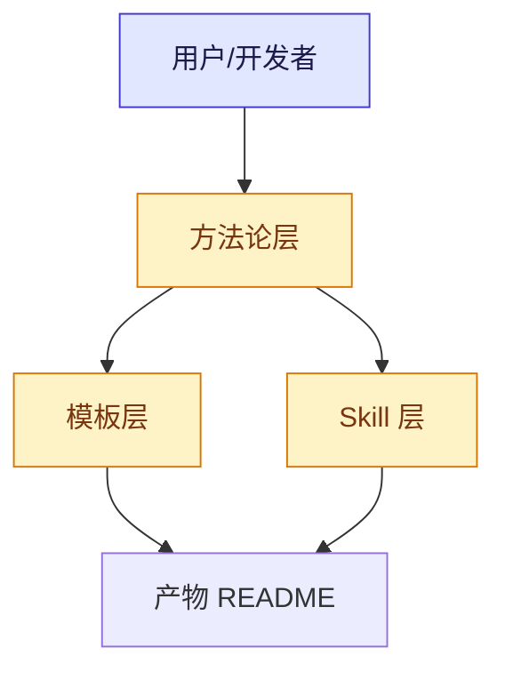
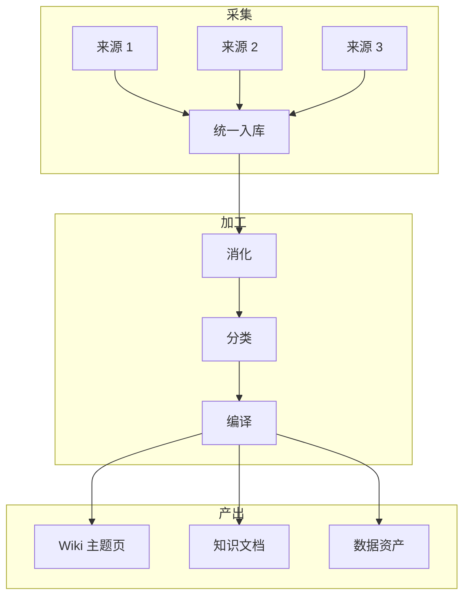
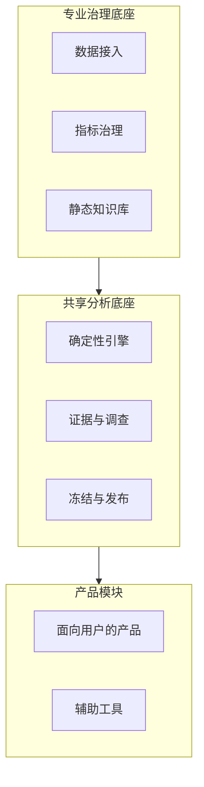

# Template: CN-Academic v3（中文知识库 / 方法论项目 + 双语）

<!-- @placeholders project_name=required chinese_full_name=required english_subtitle=required tagline=required positioning=required misconception=required core_question=required screenshot_caption=required metric_test_count=conditional metric_coverage_percent=conditional metric_resource_count=conditional metric_doc_count=conditional metric_knowledge_count=conditional metric_user_count=conditional competitor_a=conditional competitor_b=conditional onboarding_cost=conditional automation_level=conditional auditability=conditional suitable_scale=conditional team_name=optional -->

> **适用**：方法论仓库 / 知识库项目 / 中文为主的研究型项目
> **核心铁律**：T1 + T2 + T8（emoji 分组）+ T9（架构图）+ T12（Roadmap checkbox）+ T13（双语）/ T15（LLM 元数据）/ T16（a11y）必含
> **范例参考**：选择你所在领域的真实优秀知识库仓库作参照
> **占位符**：双花括号显式占位符（形如 project_name 的 snake_case 名）；`conditional` 项不满足条件时整节删除，不得留空或编造

---

## 双语策略（T13 + T17）

CN-Academic 项目先按 **T17 反推默认语言**，再决定语言集合：

```
中文用户为主（国内知识库/方法论，最常见）：
   README.md       — 中文（默认，用户打开看到中文）
   README.en.md    — 英文（可选第二语言）

海外用户为主（出海项目）：
   README.md       — 英文（默认，GitHub 搜索匹配）
   README.zh.md    — 中文
```

两文件结构保持一致；命名遵循 BCP 47（`README.en.md` / `README.zh.md`）。

### README.md 顶部（中文默认时）

```markdown
---
name: {{project_name}}
description: {{tagline}}
---

# 📚 {{project_name}}

**{{english_subtitle}}**

**[中文文档](./README.md)** · [English](./README.en.md)
```

---

## 架构图增强（T9 + T16）



> **a11y 注释**：mermaid 图自带结构化描述，屏读器可识别节点关系。给图加 `alt="三层架构图：方法论层 → 模板层 + Skill 层 → README 产物"`。

---

```markdown
<div align="center">

# 📚 {{project_name}}

**{{chinese_full_name}}**

**{{english_subtitle}}**

`{{tagline}}`

[](...) []() []() [](...)

[快速开始](#-快速开始) · [核心亮点](#-核心亮点) · [方法论](#-方法论) · [架构](#-架构) · [Roadmap](#-roadmap)

</div>

---


> **{{project_name}}** 是 {{positioning}}。它不是 {{misconception}}，它回答的问题是：**{{core_question}}**。

---

## ✨ 核心亮点

| | 特性 | 说明 |
|---|---|---|
| 🎯 | **[特色 1]** | 一句话说明独特价值（不要"完成了 P0"） |
| 🔀 | **[特色 2]** | 一句话说明 |
| ⚡ | **[特色 3]** | 一句话说明 |
| 🤖 | **[特色 4]** | 一句话说明 |
| 🧠 | **[特色 5]** | 一句话说明 |
| 🔁 | **[特色 6]** | 一句话说明 |

## 📸 它跑起来长什么样


> 上图说明：{{screenshot_caption}}。


## 📊 数据看板（条件章节：所有数字必须可验证，否则整节删除）

| 指标 | 数值 | 指标 | 数值 |
|---|---|---|---|
| 🧪 测试 | **{{metric_test_count}} 全绿** | 📈 覆盖率 | **{{metric_coverage_percent}}%** |
| 📚 资源 | **{{metric_resource_count}} 篇** | 📝 文档 | **{{metric_doc_count}} 份** |
| 🧠 提炼知识 | **{{metric_knowledge_count}} 份** | 🌍 用户 | **{{metric_user_count}}** |

## 🚀 快速开始

### 第 0 步 · 配置

```bash
# 按项目真实技术栈填写，以下为 Python 项目示例
python -m venv .venv && source .venv/bin/activate
pip install -r requirements.txt
python main.py validate
```

### 第 1 步 · 首次全量

```bash
# 按项目真实命令填写
python main.py sync --mode full
```

### 第 2 步 · 增量同步

```bash
python main.py sync --mode incremental
```

### 第 3 步 · 查看产出

打开产出目录，所有处理结果在子目录里。

详细文档：[`docs/quickstart.md`](docs/quickstart.md)

## 🗺️ 工作原理



**主逻辑链**：来源 → 消化 → 分类 → 编译 → 产出

## 📚 方法论

> 如果你的项目本身就是一套方法论，给一段方法论精要。

### 核心原则

1. **原则 1** - 一句话解释为什么
2. **原则 2** - 一句话解释为什么
3. **原则 3** - 一句话解释为什么

### 工具箱

| 工具 | 用途 |
|---|---|
| **[工具 1]** | 解决什么问题 |
| **[工具 2]** | 解决什么问题 |
| **[工具 3]** | 解决什么问题 |

## 🏗️ 架构（如果项目足够复杂）


或 mermaid：



## 📁 项目结构

```
project/
├── src/                  # 核心代码
│   ├── module_a/         # 模块 A 说明
│   ├── module_b/         # 模块 B 说明
│   └── ...
├── docs/                 # 文档
│   ├── 01-methodology/   # 方法论
│   ├── 02-architecture/   # 架构
│   └── 03-runbook/       # 操作手册
├── tests/                # 测试
├── data/                 # 数据
└── output/               # 产出
```

## 🆚 替代方案对比

| 维度 | {{project_name}} | {{competitor_a}} | {{competitor_b}} |
|---|---|---|---|
| 上手成本 | {{onboarding_cost}} | {{onboarding_cost}} | {{onboarding_cost}} |
| 自动化程度 | {{automation_level}} | {{automation_level}} | {{automation_level}} |
| 可审计性 | {{auditability}} | {{auditability}} | {{auditability}} |
| 适用规模 | {{suitable_scale}} | {{suitable_scale}} | {{suitable_scale}} |

> 对比结论必须有可溯源依据（实测或公开文档），不写拍脑袋结论（T11 反虚假约束）。

## 🗓️ Roadmap

- [x] 已交付的里程碑（真实日期）
- [ ] 下一季度可交付目标
- [ ] 下下一季度可交付目标

## 📚 文档导航

| 类别 | 文档 |
|---|---|
| 总纲 | [docs/00-overview.md](docs/00-overview.md) |
| 方法论 | [docs/01-methodology/](docs/01-methodology/) |
| 架构 | [docs/02-architecture/](docs/02-architecture/) |
| 操作手册 | [docs/03-runbook/](docs/03-runbook/) |

## 🤝 贡献

欢迎 PR！详见 [CONTRIBUTING.md](CONTRIBUTING.md)。

## 💖 致谢

- [上游 / 灵感来源](https://...) — 真实的启发来源

## 📜 License

[MIT](LICENSE) — 拿去用，注明出处就行。

---

<div align="center">

<sub>📌 {{project_name}} 由 {{team_name}} 用 ❤️ 维护</sub>

</div>
```

---

## 中文项目特殊要求

1. **双语标识**：项目名 + English Subtitle，让国际用户看懂
2. **emoji 分组**：每个核心亮点必须有 emoji，比纯文字更醒目
3. **数据看板**：用中文表格而非纯数字，让非技术读者也能理解
4. **架构图中文标注**：避免英文术语滥用，关键概念翻译过来
5. **Roadmap 用 checkbox**：方便社区跟踪进度

---

## 评分目标（v3 归一化口径）

| 项 | 目标 |
|---|---|
| 总行数 | 300-700 |
| 图片数 | ≥ 5（hero + 截图组 + 架构 + 数据） |
| **必含铁律** | T1 + T2 + T8 + T9 + T12 + T13（双语）+ T15（LLM 元数据）+ T16（a11y） |
| **推荐铁律** | T14（包容性语言） |
| emoji 密度 | 每章至少 1 个 |
| **评分口径** | 归一化百分制 + 适用项数 + 未核验项数；未核验项清零前不输出总分 |

---

## 中文 README 反模式

- ❌ 直接翻译英文 README 而不调整结构
- ❌ "完成了 P0 P1 P2" ✅ 列表主导
- ❌ 没有架构图，纯文字描述
- ❌ 用 emoji bullet 堆砌"功能"而非"亮点"
- ❌ Roadmap 写成愿景而非季度交付
- ❌ **v2 新增**：海外用户 > 10% 但 README 只中文（A9）
- ❌ **v2 新增**：架构图无中文标注 / 无 a11y alt（违反 T16）
- ❌ **v2 新增**：用 "John Smith" 翻译 "张三李四" 单一风格（违反 T14）

---

## 实战建议

1. **方法论章节用粗体 + emoji** — 让重点跳出来
2. **数据看板用中文描述** — 不是堆数字
3. **架构图分模块上色** — 用 mermaid `classDef`
4. **Roadmap 标注预计时间** — 不是空 checkbox
5. **v2 新增**：双语策略按 T17 定默认语言（中文项目：README.md 中文 + README.en.md 英文）— 不是两个独立 README
6. 可选：以 `llms.txt` 或（合法的）frontmatter 提供结构化元数据（D-4：不强制顶部 frontmatter）

---

<div align="center">
<sub>📜 中文 README 的最高境界：让母语读者一眼看懂 + 国际读者通过双语标识入门。</sub>
<br>
<sub>🤖 语义标题与代码块让 LLM 30 秒读懂；结构化元数据可选。</sub>
</div>
