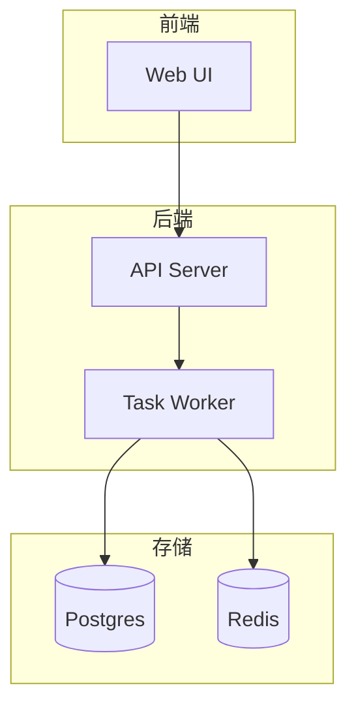

# Template: Rich v3（图文并茂 + 视觉矩阵，400+ 行）

<!-- @placeholders project_name=required tagline=required repo_owner=required homepage_url=optional hero_caption=required demo_video_url=conditional install_command_macos=conditional install_command_windows=conditional install_command_linux=conditional install_command_docker=conditional metric_test_count=conditional metric_coverage_percent=conditional metric_package_size_mb=conditional metric_user_reach=conditional competitor_a=conditional competitor_b=conditional metric_install_commands=conditional metric_startup_time=conditional metric_memory=conditional metric_language_count=conditional customer_a_name=conditional customer_a_use=conditional customer_b_name=conditional customer_b_use=conditional team_name=optional -->

> **适用**：GUI 桌面应用 / Web 应用 / AI 产品 / 强展示型项目
> **核心铁律**：T1-T19 按项目适用项全打，重点是 T1/T6/T8/T16（视觉轴 + a11y）+ T15（LLM 友好）+ T18（截图自动化）
> **范例参考**：[fastapi](https://github.com/fastapi/fastapi)、[lobehub/lobe-chat](https://github.com/lobehub/lobe-chat)
> **占位符**：双花括号显式占位符（形如 project_name 的 snake_case 名）；`conditional` 项不满足条件时整节删除，不得留空或编造

---

## 常用片段（按需选用）

### YAML Frontmatter（T15 · 可选增强）

```markdown
---
name: {{project_name}}
description: {{tagline}}
license: MIT
homepage: {{homepage_url}}
---
```

### 视觉矩阵 3 截图 + 1 视频（T6）

```markdown
## 🎬 Demo

[]({{demo_video_url}})
*30-60 秒演示，无音频带字幕*

## 📸 Screenshots

<p align="center">
  <a href="assets/screenshot-1.png"></a>
  <a href="assets/screenshot-2.png"></a>
  <a href="assets/screenshot-3.png"></a>
</p>
```

### 包容性示例人名（T14）

文档示例代码里用 `Alex Rivera` / `Mei Lin` / `Priya Patel` 而非 `John Smith`。

### 收尾五件套（T12）

```markdown
## 🤝 Contributing & Code of Conduct

欢迎 PR！详见 [CONTRIBUTING.md](CONTRIBUTING.md)。
本项目采用 [Contributor Covenant](CODE_OF_CONDUCT.md) v2.1。

## 🔒 Security

发现安全漏洞请按 [SECURITY.md](SECURITY.md) 的私密渠道披露。
<!-- 占位说明：不要虚构 security@ 邮箱；用 GitHub 私密漏洞报告或真实可用的披露渠道 -->
```

---

```markdown
<div align="center">

# 🎨 {{project_name}}

**{{tagline}}**

[]() []() []() []() []()

[📖 文档](docs/) · [🎬 Demo](#-演示视频) · [🚀 快速开始](#-快速开始) · [📸 截图](#-截图) · [🤝 贡献](#-贡献)

</div>

---


> **一句话**：{{hero_caption}}

---

## 🎬 演示视频

> 如果你的项目有 30-60 秒的演示视频，放在这里；没有就整节删除。

[]({{demo_video_url}})

---

## 📸 截图

### 主界面

<p align="center">
  <a href="./assets/screenshots/home.png"></a>
  <a href="./assets/screenshots/edit.png"></a>
  <a href="./assets/screenshots/export.png"></a>
</p>

<p align="center">
  <a href="./assets/screenshots/settings.png"></a>
  <a href="./assets/screenshots/keyboard.png"></a>
  <a href="./assets/screenshots/themes.png"></a>
</p>

### 终端 / CLI 输出


*真实命令输出截图，不可用示意图替代。*

### 数据看板（条件章节：所有数字必须可验证，否则整节删除）

| 指标 | 数值 | 指标 | 数值 |
|---|---|---|---|
| 🧪 测试 | **{{metric_test_count}} 全绿** | 📈 覆盖率 | **{{metric_coverage_percent}}%** |
| 📦 包大小 | **{{metric_package_size_mb}} MB** | 🌍 用户 | **{{metric_user_reach}}** |

---

## ✨ 卖点

- **[卖点 1]** - 一行量化收益（数字须可复现，如基准测试链接）
- **[卖点 2]** - 一行量化收益
- **[卖点 3]** - 一行量化收益
- **[卖点 4]** - 一行量化收益
- **[卖点 5]** - 一行量化收益
- **[卖点 6]** - 一行量化收益

## 🏗️ 架构


或 mermaid：



## 🚀 快速开始

### 安装

#### macOS

```bash
{{install_command_macos}}
```

#### Windows

```powershell
{{install_command_windows}}
```

#### Linux

```bash
{{install_command_linux}}
```

#### Docker

```bash
{{install_command_docker}}
```

### Quick Start

```bash
# 1. 配置
{{project_name}} init

# 2. 启动
{{project_name}} run
```

**真实输出**：


## 📦 功能

### 🎯 核心能力

- 🎨 **[能力 1]** - 一句话描述
- ⚡ **[能力 2]** - 一句话描述
- 🔐 **[能力 3]** - 一句话描述
- 🧠 **[能力 4]** - 一句话描述

### 🖥️ 平台支持

| 平台 | 状态 | 备注 |
|---|---|---|
| 按真实支持矩阵填写 | ✅ / ⚠️ / ❌ | 不虚构平台支持（T4） |

### 🔌 扩展能力

- 🧩 **插件系统** - 通过 [plugin docs](docs/plugin.md) 扩展
- 🌐 **i18n** - 按真实支持语言列表填写

## 🆚 对比

| 维度 | {{project_name}} | {{competitor_a}} | {{competitor_b}} |
|---|---|---|---|
| 安装命令数 | {{metric_install_commands}} | {{metric_install_commands}} | {{metric_install_commands}} |
| 启动时间 | {{metric_startup_time}} | {{metric_startup_time}} | {{metric_startup_time}} |
| 内存占用 | {{metric_memory}} | {{metric_memory}} | {{metric_memory}} |
| 多语言 | {{metric_language_count}} | {{metric_language_count}} | {{metric_language_count}} |

> 对比数据必须来自可复现实测，每格标注测量条件（T11 反虚假约束）。

## 📊 谁在用（条件章节：仅有真实授权 logo 时保留，否则整节删除）

| Logo | 客户 / 项目 | 场景 |
|---|---|---|
|  | {{customer_a_name}} | {{customer_a_use}} |
|  | {{customer_b_name}} | {{customer_b_use}} |

> 用户引言同样必须真实可溯源，不虚构"某公司 CTO"式 quote。

## 🗓️ Roadmap

- [x] 已交付的里程碑（真实日期）
- [ ] 下一季度可交付目标
- [ ] 下下一季度可交付目标

## 🤝 贡献

欢迎 PR！详见 [CONTRIBUTING.md](CONTRIBUTING.md)。

代码风格 / 测试要求 / 提交规范，一份文档搞定。

## 💖 致谢

- [上游项目](https://...) — 真实的启发来源
- 所有贡献者 — [Contributors](https://github.com/{{repo_owner}}/{{project_name}}/graphs/contributors)

## 📜 License

[MIT](LICENSE) — 拿去用，注明出处就行。

---

<div align="center">

<sub>📌 {{project_name}} 由 {{team_name}} 用 ❤️ 维护 · [⭐ Star 我们](https://github.com/{{repo_owner}}/{{project_name}}) · [🐛 报告 Bug](https://github.com/{{repo_owner}}/{{project_name}}/issues)</sub>

</div>
```

---

## 评分目标（v3 归一化口径）

| 项 | 目标 |
|---|---|
| 总行数 | 400-800 |
| 图片数 | ≥ 8（hero + 截图组 + 终端 + 架构 + 数据看板 + logo 墙） |
| **必含铁律** | T1-T19 按适用项（视频 / 客户引用 / 多语言为条件项，可 N/A） |
| 视频/动图 | ≥ 1（GIF 或 MP4，条件项） |
| **评分口径** | 归一化百分制 + 适用项数 + 未核验项数；未核验项清零前不输出总分 |

---

## 视觉节奏控制

每章之间用 `---` 分隔，让读者有"喘息"：

```
1. 首屏 + logo + badge        (30 行)
2. Hero 视觉                  (10 行)
3. 演示视频（可选）           (10 行)
4. 截图三列 × 2                (20 行)
5. 终端 + 数据看板             (20 行)
6. 卖点                       (10 行)
7. 架构图                     (15 行)
8. 安装多路                   (40 行)
9. Quickstart + 真实输出      (30 行)
10. Feature 分组              (60 行)
11. 对比表                    (20 行)
12. 谁在用                    (15 行)
13. Roadmap + 贡献 + License  (30 行)
```

---

## 实战建议

1. **截图必须真实** — 不要拿 Figma 示意图充数
2. **动图比截图更生动** — 30 秒演示动图价值 = 10 张截图
3. **logo 墙最多 8 个** — 多了喧宾夺主
4. **数据看板要有出处** — 每个数字附可验证来源

---

## 反模式提醒

- ❌ 截图全用占位符（用户不知道真实长什么样）
- ❌ 架构图用文字段落描述
- ❌ Feature 章节长达 200 行不分组
- ❌ 数据看板用 emoji 凑数（"🚀 🎉 ✨" 不是数据）
- ❌ logo 墙超过 8 个
- ❌ **v2 新增**：所有截图 alt 都写 "screenshot"（违反 T16 a11y）
- ❌ **v2 新增**：30s 演示视频有音频无字幕（违反 T16 a11y）
- ❌ **v2 新增**：用 "John Smith" 作示例人名（违反 T14 包容性）
- ❌ **v2 新增**：海外用户 > 10% 但 README 只中文（A9）

---

<div align="center">
<sub>📜 Rich 不是堆视觉，是用视觉降低读者的认知负担。</sub>
<br>
<sub>♿ v2 新增：让视障用户也能听清，让海外用户也能读懂。</sub>
</div>
