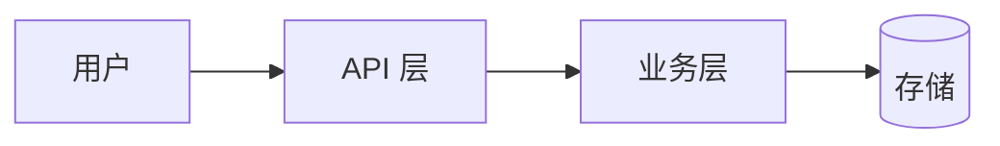

# Template: Standard v3（200-400 行）

<!-- @placeholders project_name=required value_proposition=required repo_owner=required homepage_url=optional real_output=required install_command_macos=conditional install_command_linux=conditional install_command_windows=conditional install_command_docker=conditional macos_min_version=conditional macos_support_status=conditional linux_min_version=conditional linux_support_status=conditional windows_min_version=conditional windows_support_status=conditional customer_a_name=conditional customer_a_use=conditional customer_b_name=conditional customer_b_use=conditional competitor_a=conditional competitor_b=conditional metric_install_commands=conditional metric_startup_time=conditional metric_memory=conditional team_name=optional -->

> **适用**：后端服务 / 框架 / 库 / 通用工具
> **核心铁律**：T1-T12 全部 + T13 / T15 必含
> **范例参考**：[denoland/deno](https://github.com/denoland/deno)、[tauri-apps/tauri](https://github.com/tauri-apps/tauri)
> **占位符**：双花括号显式占位符（形如 project_name 的 snake_case 名）；`conditional` 项不满足条件时整节删除，不得留空或编造

---

## 常用片段（按需选用）

### YAML Frontmatter（T15 · 可选增强）

```markdown
---
name: {{project_name}}
description: {{value_proposition}}
license: MIT
homepage: {{homepage_url}}
repository: https://github.com/{{repo_owner}}/{{project_name}}
---
```

### i18n 切换（T13 · README 顶部 logo 下方）

```markdown
**[English] · [中文](./README.zh.md) · [日本語](./README.ja.md)**
```

### 收尾五件套（T12 · README 末尾）

```markdown
## 🤝 Contributing & Community

欢迎 PR！详见 [CONTRIBUTING.md](CONTRIBUTING.md)。
本项目采用 [Contributor Covenant](CODE_OF_CONDUCT.md) v2.1。

## 🔒 Security

发现安全漏洞请按 [SECURITY.md](SECURITY.md) 的私密渠道披露。
<!-- 占位说明：不要虚构 security@ 邮箱；用 GitHub 私密漏洞报告或真实可用的披露渠道 -->

## 📜 License

[MIT](LICENSE) — 拿去用，注明出处就行。
```

---

```markdown
<div align="center">

# 🚀 {{project_name}}

**{{value_proposition}}**

[](...) []() []() []() []()

[📖 文档](docs/) · [🚀 快速开始](#-快速开始) · [🤝 贡献](#-贡献) · [📜 License](#-license)

</div>

---


> 一句话讲清楚这个图表达什么。

---

## ✨ 卖点（Key Features）

- **[卖点 1]** - 量化收益（例如："速度对标 NodeJS/Go"，数字须可复现）
- **[卖点 2]** - 量化收益
- **[卖点 3]** - 量化收益
- **[卖点 4]** - 量化收益
- **[卖点 5]** - 量化收益

## 🏗️ 架构



## 🚀 安装

> 仅保留项目**正式支持**的平台路径；不虚构不支持的安装方式（T4）。

### macOS
```bash
{{install_command_macos}}
```

### Linux
```bash
{{install_command_linux}}
```

### Windows
```powershell
{{install_command_windows}}
```

### Docker
```bash
{{install_command_docker}}
```

## 🏃 快速开始

```bash
# 1. 初始化
{{project_name}} init my-app

# 2. 启动
cd my-app && {{project_name}} run
```

输出：

```text
{{real_output}}
```

完整教程：[`docs/quickstart.md`](docs/quickstart.md)

## 📦 功能

### 核心功能

- 🎯 **[能力 1]** - 一句话描述
- ⚡ **[能力 2]** - 一句话描述
- 🔐 **[能力 3]** - 一句话描述

### 平台支持

| 平台 | 版本 | 状态 |
|---|---|---|
| macOS | {{macos_min_version}} | {{macos_support_status}} |
| Linux | {{linux_min_version}} | {{linux_support_status}} |
| Windows | {{windows_min_version}} | {{windows_support_status}} |

### 扩展能力

- 🔌 **插件系统** - 通过 [plugin docs](docs/plugin.md) 扩展
- 🌍 **多语言** - i18n 支持：按真实支持列表填写

## 📊 谁在用（条件章节：仅有真实授权 logo 时保留，否则整节删除）

| Logo | 客户 / 项目 |
|---|---|
|  | {{customer_a_name}} — {{customer_a_use}} |
|  | {{customer_b_name}} — {{customer_b_use}} |

> 客户名称与用途必须真实且获授权（T11 反虚假约束）。

## 🆚 对比

| 维度 | {{project_name}} | {{competitor_a}} | {{competitor_b}} |
|---|---|---|---|
| 安装命令数 | {{metric_install_commands}} | {{metric_install_commands}} | {{metric_install_commands}} |
| 启动时间 | {{metric_startup_time}} | {{metric_startup_time}} | {{metric_startup_time}} |
| 内存占用 | {{metric_memory}} | {{metric_memory}} | {{metric_memory}} |

> 对比数据必须来自可复现实测，每格标注测量条件；不写拍脑袋数字（T11 反虚假约束）。

## 🗓️ Roadmap

- [x] 已交付的里程碑（真实日期）
- [ ] 下一季度可交付目标
- [ ] 下下一季度可交付目标

## 🤝 贡献

欢迎 PR！详见 [CONTRIBUTING.md](CONTRIBUTING.md)。

## 📜 License

[MIT](LICENSE) — 拿去用，注明出处就行。

---

<sub>📌 {{project_name}} 由 {{team_name}} 用 ❤️ 维护。</sub>
```

---

## 评分目标（v3 归一化口径）

| 项 | 目标 |
|---|---|
| 总行数 | 200-400 |
| 图片数 | ≥ 5（hero + 截图组 + 架构 + 对比） |
| **必含铁律** | T1-T12 + T13 + T15 + T16 |
| **推荐铁律** | T11（早期项目可标"建设中"）、T14 |
| **评分口径** | 归一化百分制 + 适用项数 + 未核验项数；未核验项清零前不输出总分 |

---

## 章节顺序的逻辑

1. **首屏**：logo + 价值主张 + badges + 链接导航
2. **Hero 图**：抓住眼球
3. **卖点编号**：让读者 30 秒决定要不要继续
4. **架构图**：让技术读者决定要不要深入
5. **安装多路**：让读者 60 秒装上
6. **Quickstart**：让读者 3 分钟跑通 demo
7. **功能分组**：让读者评估完整度
8. **谁在用 / 对比**：让读者决定可信度
9. **Roadmap + 贡献 + License**：收尾

---

## 实战建议

1. **每章控制在 50-80 行** — 超过就要再分
2. **Quickstart 必须有真实输出截图** — 不是示意图
3. **对照表的"对手"必须真实存在** — 不要拉踩不存在的项目
4. **Roadmap 不要过度承诺** — 写下季度可交付的目标

---

## 反模式提醒

- ❌ 把 hero 图放在 Features 后面（应该第二屏）
- ❌ 安装命令只给 1 路（"macOS brew"）
- ❌ Quickstart 不给真实输出
- ❌ Roadmap 写成产品愿景（应该写成季度交付）
- ❌ 对照表只夸自己（要给真实对比）
- ❌ **v2 新增**：海外用户占比 > 10% 但只英文 README（A9）
- ❌ **v2 新增**：图像 alt 全是 "image" / "screenshot"（违反 T16 a11y）
- ❌ **v2 新增**：用 "John Smith" 作唯一示例人名（违反 T14 包容性）

---

<div align="center">
<sub>📜 Standard 是大多数项目应该达到的及格线。</sub>
<br>
<sub>🤖 达标的 Standard 让 LLM 也能 30 秒读懂。</sub>
</div>
